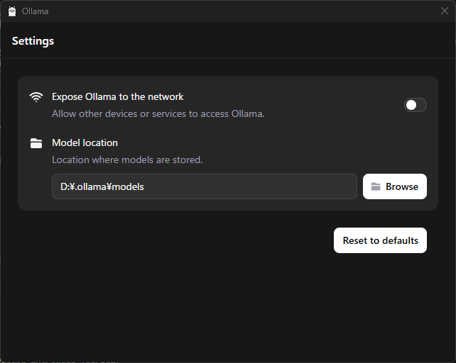

# シークレットNG Discord Bot

このBotは「シークレットNG」ゲームのゲームマスターとして機能します。

## 機能

- ゲーム開始コマンド (`/start`) に反応し、ボイスチャンネルに参加します。
- プレイヤーの音声を文字起こしし、「NGワード」を検出します。
- プレイヤーが一定回数「NGワード」を発すると脱落します。
- 最後の1人が勝者となり、ゲームが終了します。
- ゲーム終了コマンド (`/stop`) に反応し、ボイスチャンネルから退出します。

## ゲームルール

- ゲーム開始時にゲームマスターがいくつかの「NGワード」を設定します。
- プレイヤーが発した言葉の中に「NGワード」が含まれていた場合、ゲームマスターはゲームを一時中断し、「NGワード」が発せられたことを全プレイヤーに通知します。その後、ゲームを再開します。
- プレイヤーが一定回数「NGワード」を発すると脱落します。
- 脱落しなかった最後の1人が勝者となり、ゲームは終了します。

## Botの仕様

- 「シークレットNG」ゲームのゲームマスターとして機能します。
- 「ゲーム開始」を意図する特定のコマンド (`/start`) に反応し、Discordサーバのボイスチャンネルに入室します。
  - その後、ゲームスタートの合図を出します。
- 「ゲーム終了」を意図する特定のコマンド (`/stop`) に反応し、ボイスチャンネルから退室します。
  - 「シークレットNG」ゲームで勝者が決まった場合にも、ボイスチャンネルから退室します。
- ボイスチャンネルに入室中は全てのプレイヤーの音声を文字起こしし、内部に記録します。

## セットアップ

### 手順の前提

- WindowsでWSL2を使ってアプリケーションを開発・ビルド・動作させます
  - 一部のサブシステムは、WSL2を使わず、Windows上で動作させます
- 本リポジトリはWSL2内にgit cloneしているものとします

### セットアップ手順

1. 必要な依存関係をインストールします:
   ```bash
   npm install
   ```
1. Discord Developer PortalでBotを作成し、トークンを取得します。
1. `.env` ファイルにトークンを設定します。
1. Botをビルドします:
   ```bash
   npm run build
   ```
1. 実行できるかテストします。
   ```bash
   sudo apt update
   sudo apt install cmake
   ```
   ```bash
   npm test
   ```
1. Botを起動します:
   ```bash
   npm start
   ```

## ローカルLLM APIサーバのセットアップ手順

このBotの文字起こし精度向上には、ローカルLLM APIサーバ（Ollamaまたはllama.cpp）を起動する必要があります。

### 推奨: Ollamaによるセットアップ

#### 1. Ollamaのインストール

Windowsの場合（WSL2含む）:

1. [公式 HP](https://ollama.com/download) からインストーラをダウンロードし、実行
1. （必要に応じて拡張機能をインストール）
   - [Page Assist - ローカルAIモデル用のWeb UI](https://chromewebstore.google.com/detail/jfgfiigpkhlkbnfnbobbkinehhfdhndo?utm_source=item-share-cb)
1. （必要に応じてモデルのダウンロード先のディレクトリを変更）
   - 

#### 2. モデルの導入とAPIサーバの起動（例: gemma3）

Ollamaの対応しているモデルを指定して実行する際に初回ダウンロードされます。

- [ollama.com/library](https://ollama.com/library)

```powershell
ollama run gemma3
```

#### 3. WSL2のネットワーク設定（必要に応じて）

WSL2からWindows側のlocalhostへAPI接続する場合、WSL2のNW接続をNATからmirroredに変更してください。

```powershell
wsl --set-default-network mirrored
wsl --shutdown
```

詳細: https://learn.microsoft.com/ja-jp/windows/wsl/networking

#### 4. 動作確認

WSL2環境からアクセスできることを確認します

```bash
curl -X POST 'http://localhost:11434/api/chat' \
--header 'Content-Type: application/json' \
--data-raw '{
    "model": "gemma3",
    "messages": [
        {
            "role": "user",
            "content": "こんにちは。元気ですか？"
        }
    ],
    "stream": false
}'
```

---

### オプション: llama.cppによるセットアップ

このリポジトリはllama.cppをgit submoduleとして管理しています。clone後、以下のコマンドでサブモジュールを初期化・ビルドしてください。

```bash
# 親リポジトリをcloneした直後に実行
git submodule update --init --recursive
cd llama.cpp
# OpenCL対応でビルド（AMD GPU利用の場合）
cmake -S . -B build -DLLAMA_OPENCL=ON -DLLAMA_CURL=OFF
cmake --build build --config Release
# CPUのみの場合はOpenCLオプションなし
# cmake -S . -B build
# cmake --build build --config Release
```

#### 日本語学習済みモデル（gguf形式）のダウンロード

例: [ELYZA-japanese-Llama-2-7b-fast-instruct-gguf](https://huggingface.co/mmnga/ELYZA-japanese-Llama-2-7b-gguf)

```bash
# モデルファイルをllama.cpp/models/に保存
mkdir -p models
cd models
wget <モデルのダウンロードURL>
```

#### APIサーバの起動

```bash
# llama.cppディレクトリで
./build/bin/llama-server -m models/<ダウンロードしたモデル名>.gguf -ngl 32 --port 8080
```

#### 動作確認

```bash
curl -X POST http://localhost:8080/completion \
 -H "Content-Type: application/json" \
 -d '{"prompt": "こんにちは。元気ですか？", "max_tokens": 100}'
```

---

## アーキテクチャ選定（ADR）

NGワード検出機能の実装方針については、ローカルLLM（llama.cpp + 日本語学習済みモデル）を採用しています。選定理由や比較検討内容は `docs/adr-ngword-llm.md` に記載しています。

詳しくは [docs/adr-ngword-llm.md](docs/adr-ngword-llm.md) を参照してください。

## 使用方法

1. DiscordサーバーにBotを招待します。
   - `APPLICATION_ID`を作成したDISCORDアプリケーションのIDに上書きして、アクセスします
     - https://discord.com/oauth2/authorize?client_id=APPLICATION_ID&permissions=3214336&scope=bot%20applications.commands
1. 追加したBotにスラッシュコマンドを設定します
   ```bash
   node dist/registerCommands.js
   ```
1. ボイスチャンネルに参加し、`/start` コマンドを送信してゲームを開始します。
1. `/stop` コマンドでゲームを終了します。
